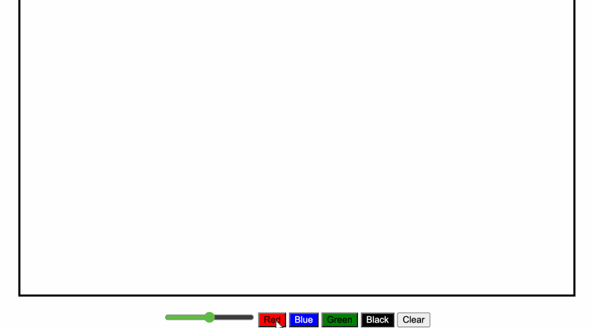

# sketch
This Sketch project was completed using HTML, Javascript DOM, and CSS with following features.
- Users can draw within the container.
- Users are able to choose between four different colors using the colored button located at the bottom.
- Users are able to choose a size of the brush using slider located at the bottom. (left = bigger, right = smaller)
- Users are able to clear the container using clear button located at the bottom.
- If users changes the size of the brush, it'll automatically clear itself.

# How to run
- Fork this repository, and clone it onto your computer.
- Drag and drop the index.html file onto your browser. 
- Or https://aseank.github.io/sketch/

